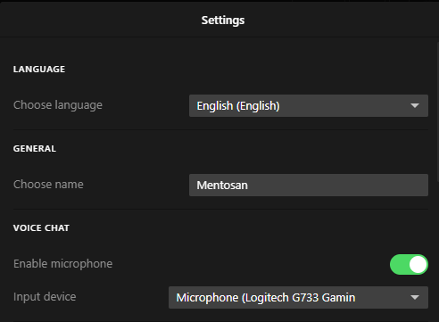

# RAGE Multiplayer

## Ce este RageMP?

Serverul rulează pe platforma **RAGE Multiplayer**, iar singura metodă prin care te poți conecta la server este aceea de a utiliza launcher-ul oficial.

Pentru a descărca launcher-ul accesați pagina oficială ([rage.mp](https://rage.mp/)) și apăsați pe butonul de <mark style="color:red;">**DOWNLOAD**</mark>.&#x20;

## Despre Launcher

Launcher-ul RageMP este construit modern și are o interfață destul de intuitivă. Însă, simțim nevoia să documentăm funcțiile prezente în launcher.

<figure><figcaption>
funcțiile launcher-ului
</figcaption></figure>

* **GTA5** - Afișează toate serverele de GTA5.
* **RDR2** - Afișează toate serverele de RDR2. (se lucrează)
* **Favourites** - Afișează serverele adăugate de utilizator la favorite. Pentru a adăuga/scoate un server de la lista de favorite se apasă _**Click dreapta**_ pe server-ul respectiv.
* **History** - Afișează serverele unde utilizatorul s-a conectat recent.
* **Direct Connect** - Te ajută să te conectezi direct pe un server.
* **Settings** - Te ajută să accesezi setările launcherului

## Setările launcher-ului

Această opțiune este puțin mai delicată și merită o rubrică separată.

<figure><figcaption>
primele setări
</figcaption></figure>

Launcher-ul RageMP suportă limba română, deci îl puteți folosi fără nicio grijă.

Nickname-ul este o setare importantă, acesta trebuie schimbat neapărat înainte de a vă conecta prima oară pe server.

**Voice Chat**

* Pe server-ul nostru opțiunea de Voice Chat va fi obligatorie, astfel trebuie să vă asigurați ca aveți opțiunea de _**Enable microphone**_ activă, cât și **Input device**-ul să fie pe intrarea microfonului dumneavoastră

<figure><figcaption>
setări avansate
</figcaption></figure>

Setările avansate nu privesc jucătorul obișnuit, însă asigurați-vă ca opțiunea _**Accelerated CEF rendering**_ este dezactivată pentru a nu avea probleme cu interfețele de pe server.
